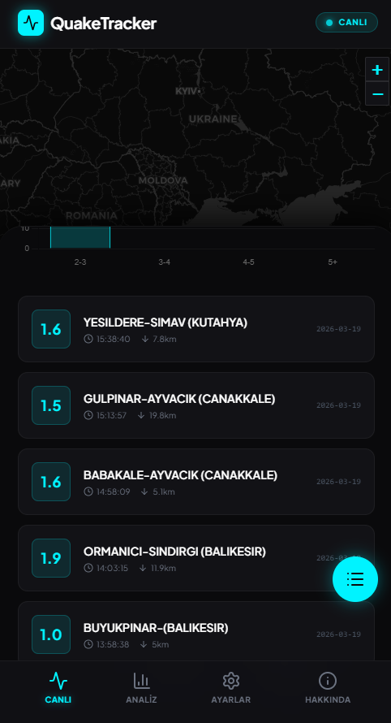
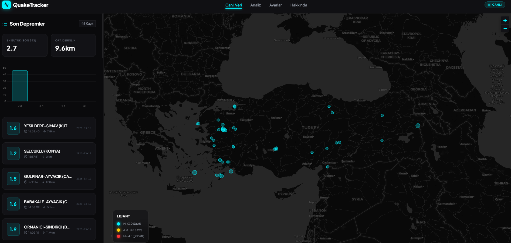

# 🌍 QuakeTracker | Modern Deprem Takip Sistemi


## 🚀 Öne Çıkan Özellikler

-   **📡 Gerçek Zamanlı Veri**: Kandilli Rasathanesi (KOERI) verileriyle anlık güncellemeler.
-   **🗺️ İnteraktif Harita**: Leaflet.js tabanlı, deprem büyüklüğüne göre dinamik işaretçiler ve detaylı pop-up'lar.
-   **📊 Analiz Merkezi**: Deprem büyüklük dağılımı (Chart.js), istatistikler ve en çok etkilenen bölgeler.
-   **📱 Mobile-First Tasarım**: Mobil cihazlar için özel alt navigasyon menüsü ve dikey kart görünümü.
-   **✨ Futuristik Arayüz**: Koyu mod, neon vurgular, cam morfolojisi (glassmorphism) ve pürüzsüz animasyonlar.
-   **🔔 Akıllı Bildirimler**: Şiddetli depremler için anlık toast bildirimleri.

---

## 📸 Ekran Görüntüleri


|



---

## 🛠️ Kullanılan Teknolojiler

-   **Frontend**: HTML5, CSS3, TailwindCSS, JavaScript (ES6+)
-   **Backend**: Node.js, Express.js
-   **Harita**: Leaflet.js, CartoDB Dark Matter Tiles
-   **Grafikler**: Chart.js
-   **İkonlar**: Lucide Icons
-   **API**: [Kandilli Live API](https://api.orhanaydogdu.com.tr/)

---

## ⚙️ Kurulum ve Çalıştırma

Projeyi yerel makinenizde çalıştırmak için şu adımları izleyin:

1.  Depoyu klonlayın:
    ```bash
    git clone https://github.com/kullaniciadi/quake-tracker.git
    ```
2.  Proje dizinine gidin:
    ```bash
    cd quake-tracker
    ```
3.  Gerekli bağımlılıkları yükleyin:
    ```bash
    npm install
    ```
4.  Uygulamayı başlatın:
    ```bash
    npm start
    ```
5.  Tarayıcınızda şu adresi açın: `http://localhost:3000`

---


---

## 📄 Lisans

Bu proje MIT lisansı altında lisanslanmıştır. Daha fazla bilgi için `LICENSE` dosyasına bakabilirsiniz.

---

**QuakeTracker** - Güvenliğiniz için anlık takip. 🛡️
